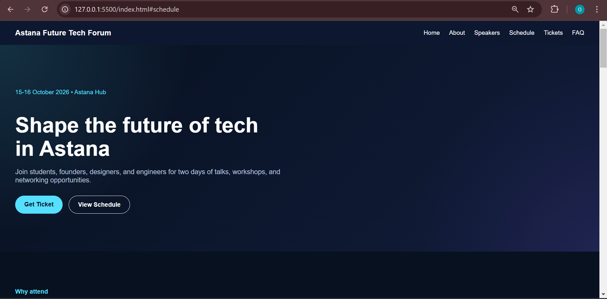

# Astana Future Tech Forum

A modern responsive landing page for a student-friendly tech conference.

## Preview

## Features
- Responsive layout
- Modern UI design
- Navigation with smooth scroll
- Hero section with CTA
- Speakers section
- Event schedule
- Tickets pricing
- FAQ section
- Interactive JavaScript features

## Tech Stack
- HTML5
- CSS3
- JavaScript

## Live Demo
(будет ссылка после GitHub Pages)

## Author
Oryngul Maratova